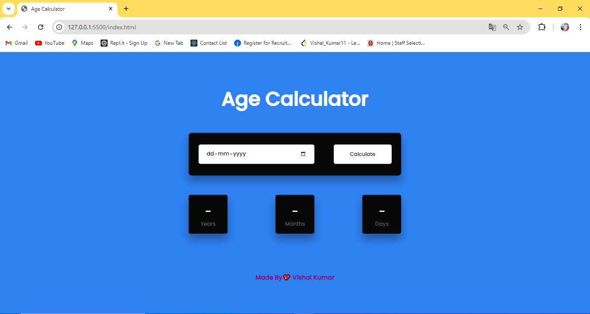
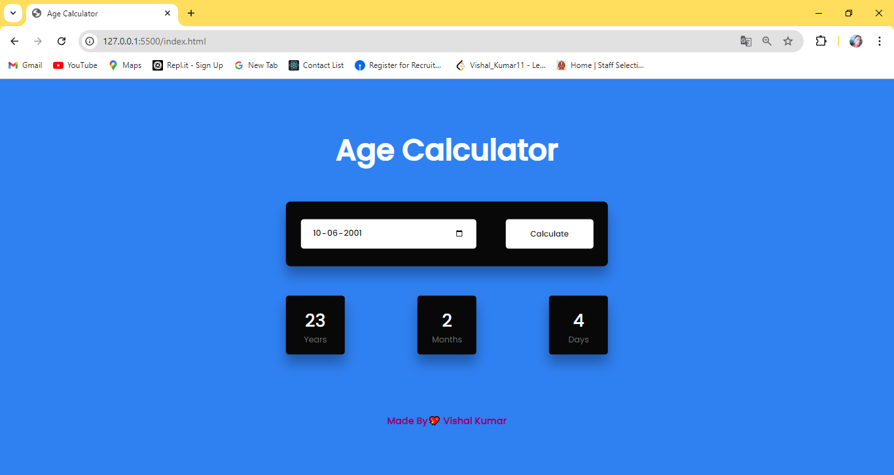

# Age Calculator

This project is a simple Age Calculator implemented using HTML, CSS, and JavaScript. The application allows users to input their birthdate and calculates their age in years, months, and days. It takes into account leap years for accurate results.

### Click the Go Live button and see the live👉 [Go Live](https://12vishalkumar.github.io/Age-Calculator)

## Features

- Calculate age in years, months, and days based on the provided birthdate.
- Handles leap years for accurate day calculations.
- Responsive design that works well on both desktop and mobile devices.
- Simple and user-friendly interface.

## Usage
- **Input Birthdate:** Use the date picker to select your birthdate.
- **Calculate Age:** Click the "Calculate" button to compute your age.
- **View Results:** The application will display your age in years, months, and days.

## Files
- **index.html:** The main HTML file that contains the structure of the application.
- **style.css:** The CSS file that styles the application.
- **script.js:** The JavaScript file that contains the logic for calculating and displaying the age.

## How to Use
1. Open index.html in your web browser.
2. Select your birthdate using the date input field.
3. Click the "Calculate" button to see your age displayed in years, months, and days.
4. The result will be shown below the button.

## Output Screen
 Here is how the Age Calculator looks when it is running:

- **Before Calculation:**
- 

- **After Calculation:**
- 

# License

This project is licensed under the MIT License. You are free to use, modify, and distribute this software with proper attribution.

# Acknowledgments
- **Google Fonts:** The Poppins font is used in this project.
- **Inspired by:** The need for a simple and accurate age calculation tool.
- **Developed by:** Vishal Kumar 💖
